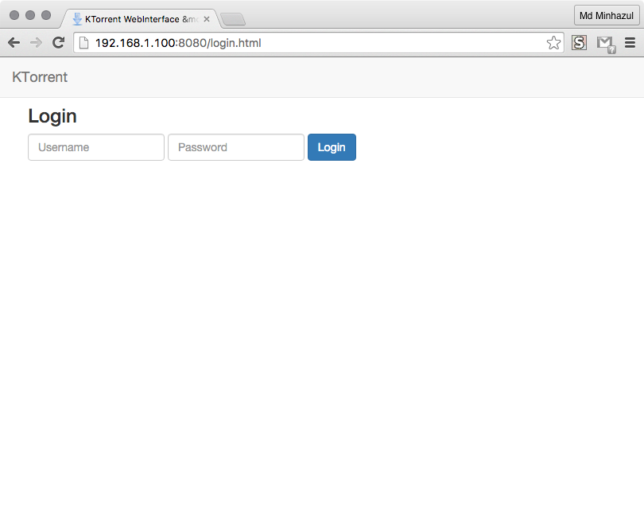
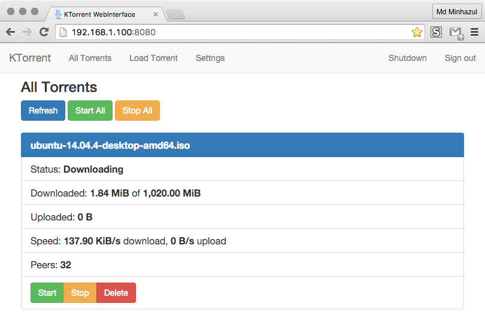
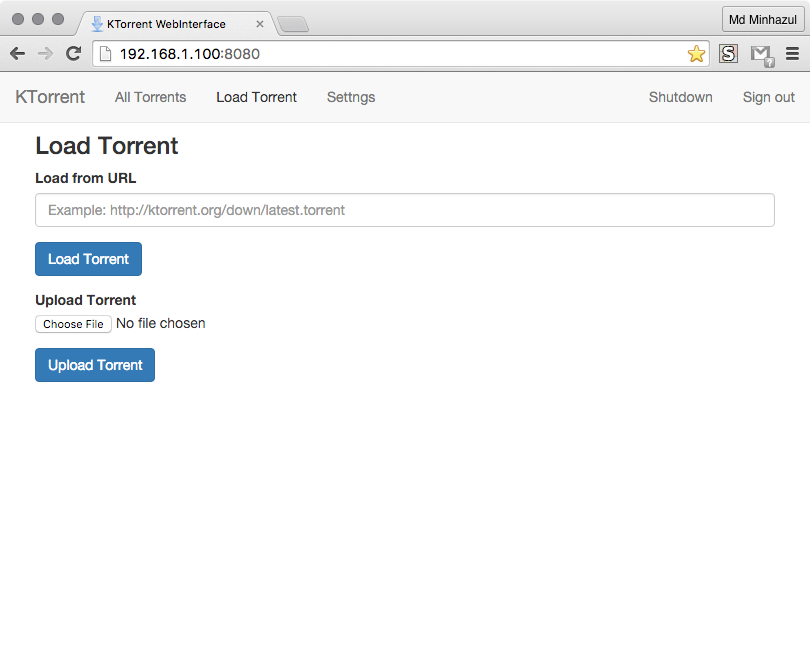
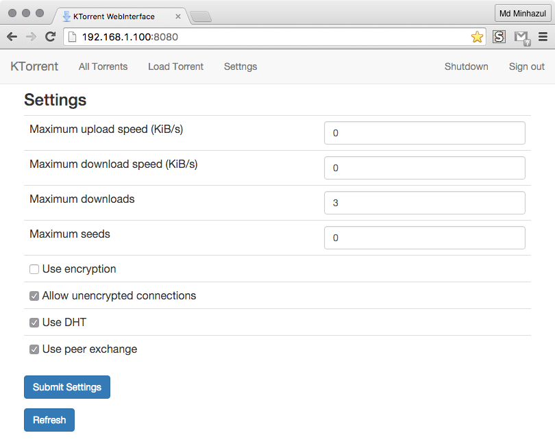
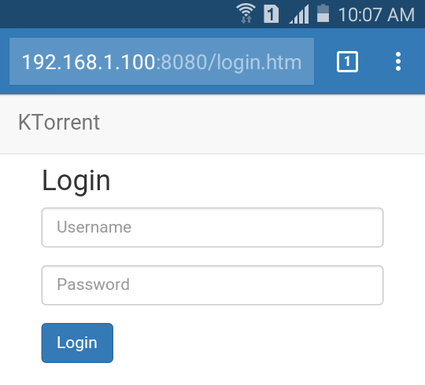
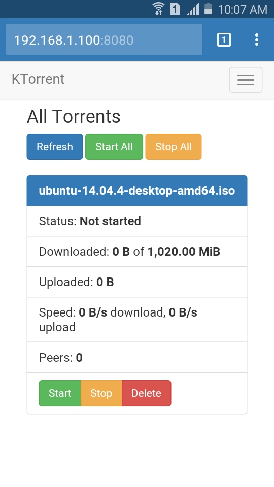
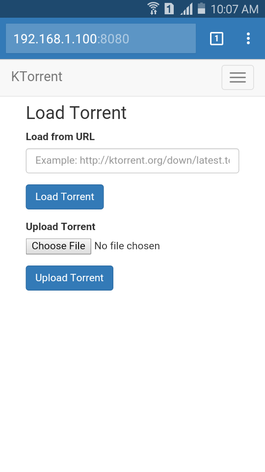
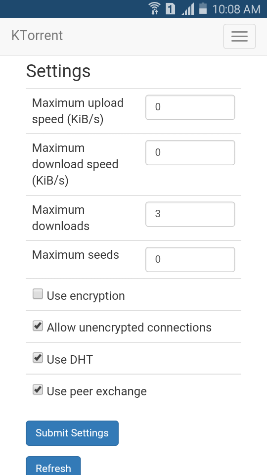

# KTorrentBootstrapUI

KTorrent WebInterface theme with Bootstrap flavour

## Features

* Clean, crisp design based on Bootstrap CSS Framework
* Mobile and desktop friendly UI, totaly responsive
* Redesigned torrent list view
* Beautify option for torrent details table
* Auto update torrent list and status (3s delay)

## Install

* Copy the folder `bootstrap` to `/usr/share/kde4/apps/ktorrent/www`
* Start KTorrent, enable `Web Interface` plugin
* Go to `Configure KTorrent`, Select `Web Interface`, and set skin to `bootstrap`
* Setup port, login etc. if necessary

## Desktop Preview

## Mobile Preview

## Licenses

The whole project is licensed under GPLv3 except for the following files.

|Filename|Source|License|
|---|---|---|
|bootstrap.* | https://github.com/twbs/bootstrap | [The MIT License (MIT)](https://tldrlegal.com/license/mit-license) |
|jquery.min.js | https://github.com/jquery/jquery | [The MIT License (MIT)](https://tldrlegal.com/license/mit-license) |

## TODO

* Submit this skin to KDE Developers
* Write a installer script

## BUGS

* `update_torrent_details` not working
